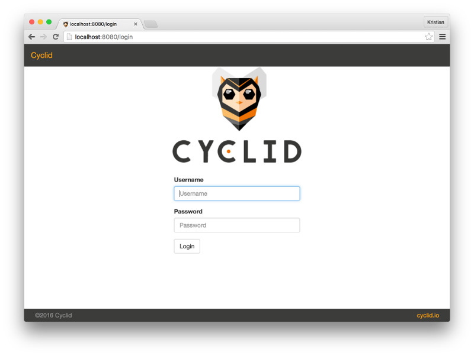

.. _vagrant:

#######
Vagrant
#######

If you just want to try Cyclid, you can download a pre-built
`Vagrant <https://www.vagrantup.com/>`__ box which contains everything
you need, already installed and configured. The box comes pre-configured
with Cyclid and its dependencies, along with LXC and Mist to create and
manage containers for your build hosts. You can start it up and begin
using it straight away.

If you don't already have it, you should `download and
install Vagrant <https://www.vagrantup.com/downloads.html>`__. You'll
also need a virtual machine hypervisor; right now the Cyclid Vagrant box
only support `VirtualBox <https://www.virtualbox.org>`__, so you'll also
need to `download and install
it <https://www.virtualbox.org/wiki/Downloads>`__ if you don't have it.

Creating a Cyclid Vagrant instance
==================================

Create a working directory somewhere and tell Vagrant to download &
start the Cyclid box:

::

    $ mkdir $HOME/Cyclid-Vagrant
    $ vagrant init Liqwyd/Cyclid
    $ vagrant up --provider virtualbox

When the Cyclid box starts it will write a Cyclid client configuration
file for you into the config directory. You should copy this file to the
client configuration directory and tell the Cyclid client to use it.

::

    $ cp config/vagrant $HOME/.cyclid
    $ cyclid organization use vagrant

You'll probably want to set a password so that you can log in to the
Cyclid User Interface.

::

    $ cyclid user passwd
    Password:
    Confirm password:

See the :ref:`Cyclid client documentation <client-commands>` for
more information on installing & configuring the command line client.

Using the Vagrant instance
==========================

The Vagrant instance is configured with the Cyclid API server running on
port 8361, and the Cyclid User Interface on port 8080. Once you've
changed your password, open a browser tab or window and connect to the
Cyclid UI at http://localhost:8080/login. Log in using the username
"admin" and the password you set.

|Cyclid|

